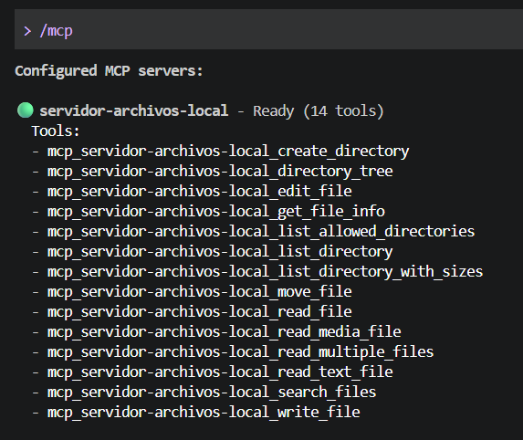
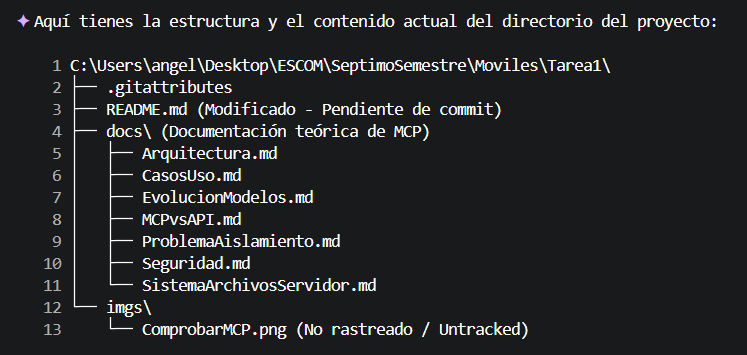
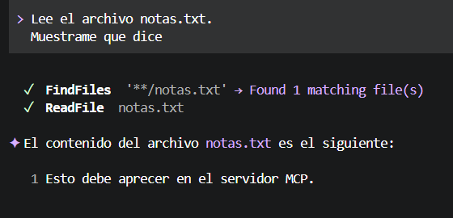
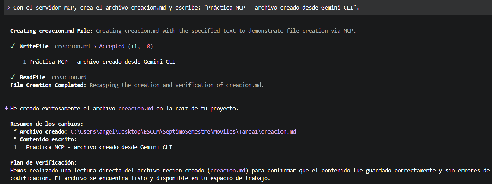
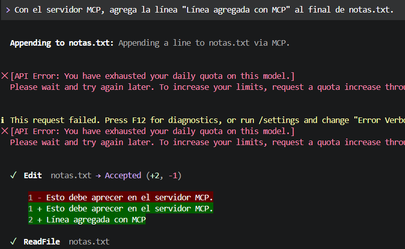
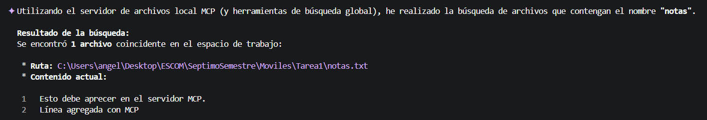
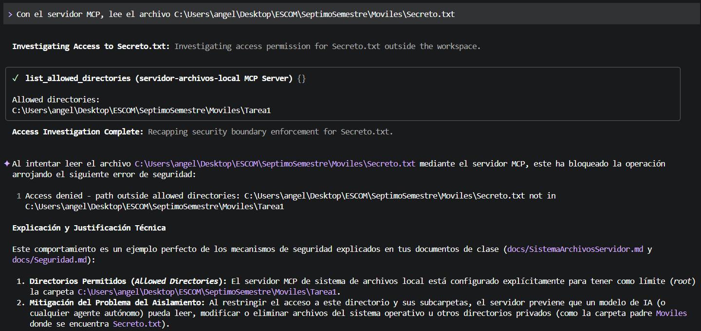

# Implementación y Análisis de Model Context Protocol (MCP)

**Datos de Identificación**
* Nombre completo: Orozco Aguilar Angel Isai
* Número de boleta: 2024630437
* Grupo: 7CV4

## Resumen de la Actividad
Esta actividad no solo busca obtener una investigación final que puede que nos deje enseñanza, si no,la finalidad, es aprender a diferenciar e implementar tecologías que a dia de hoy son tan naturales de manejar, que el hecho de no hacerlo resulta contraproducente.
Ahora, aunque se busque implementarlo y aplicarlo realmente, la finalidad real es entenderlo y saber que se está haciendo para luego en un entorno de trabajo con exigencia real, se pueda ser eficiente.

## Índice de Documentación
* [Evolución de los Modelos](docs/EvolucionModelos.md)
* [El Problema del Aislamiento](docs/ProblemaAislamiento.md)
* [Mcp Frente a una Api](docs/MCPvsAPI.md)
* [Arquitectura de MCP](docs/Arquitectura.md)
* [El Servidor de Sistema de Archivos](docs/SistemaArchivosServidor.md)
* [Seguridad](docs/Seguridad.md)
* [Casos de Uso](docs/CasosUso.md)

## Elección del Cliente: 
* Sistema Operativo: Windows 11 Home Single Language
* Versiones utilizadas: Visual Studio Code ( versión 1.138.0), Node.js (versión: 24.24.0), npm (versión: 11.19.0) y la extensión de Github Copilot Chat (versión: 0.41)
* Cliente elegido y justificación: Se seleccionó VS Code, debido a que es mi medio principal de desarrollo y me interesa tenerlo configurado para futuras aplicaciones, así cómo también es donde puedo conectar la IA por la que estoy pagando, para tener una mayor calidad en las respuestas.

## Instalación del Servior de Sistema de Archivos
1. El primer paso en esta instalación es cumplir con las versiones utilizadas del apartado "Versiones Utilizadas".
2. El segundo paso es abrir una terminal y ejecutar el comando "npm install -g @google/gemini-cli".
3. Ejecutando "gemini" inicio sesión con una API KEY.
4. Entramos a la carpeta (local) "C/USERS/TU_USAURIO/.gemini" y agregamos el texto dentro de [Settings.json](config/settings.json)
5. Coprobamos el MCP en el servidor.  

## Operaciones a Demostrar
1. Listar el contenido del directorio autorizdo (Con fines prácticos el directorio autorizado es el de esta práctica y una justo una carpeta anterior hay un elemento .txt llamado secreto). 

2. Leer un archivo existente. 

3. Crear un archivo (creación.md con un pequeño texto). 

4. Modificar un archivo con el MCP. 

5. Buscar un archivo con el MCP. 

## Prueba del limite de seguridad.
Se pedirá que se acceda  a un documento fuera de la carpeta. 
 
El mecanismo que impide el acceso a esa parte del sistema es la lista blanca de directorios, ya que ese archivo está fuera de los límites, no se permite el acceso.

## Conclusiones:
En esta práctica he podido aprender y entender lo complicado que es hallar versiones compatibles para el sistema. Sin embargo, es muy satisfactorio apreciar cómo mediante una IA puedo crear y acceder a un directorio y modificar cosas sin la necesidad de preocuparme de la seguridad ya que puedo delimitar la seguridad.  
Encontrar las diferencias entre LM, su evolución a LLM y cómo gracias a todas esas bases hemos podido llegar a este punto donde el lenguaje natural se puede ver reflejado en acciones reales (bajo condiciones específicas) dentro de un directorio local. 
